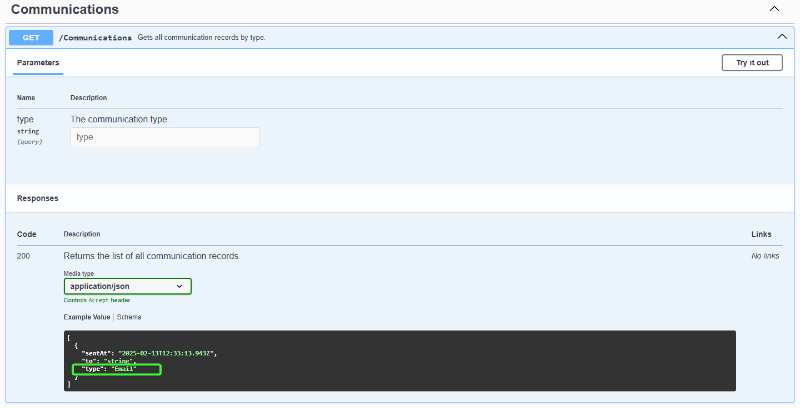

[](https://www.nuget.org/packages/PMart.Enumeration)
[](https://www.nuget.org/packages/PMart.Enumeration)
[](https://dev.azure.com/p-martinho/Enumeration/_build/latest?definitionId=1)

# PMart.Enumeration

This set of libraries provide base classes to implement __Enumeration classes__, based on `string` values.
It enables the strongly typed advantages, while using `string` enumerations.

It has, also, the possibility to create new enumerations at runtime (let's call it dynamic enumerations).

## What are Enumeration Classes?

[Enumeration classes](https://docs.microsoft.com/en-us/dotnet/architecture/microservices/microservice-ddd-cqrs-patterns/enumeration-classes-over-enum-types) are alternatives to [enum type in C#](https://docs.microsoft.com/en-us/dotnet/csharp/language-reference/builtin-types/enum).
They enable features of an object-oriented language without the limitations of the `enum` type.

They are useful, for instance, for business related enumerations on Domain-Driven Design (DDD).

## NuGet Packages

__PMart.Enumeration__: The Enumeration base classes.
[](https://www.nuget.org/packages/PMart.Enumeration)

__PMart.Enumeration.EFCore__: The Entity Framework Core support for PMart.Enumeration.
[](https://www.nuget.org/packages/PMart.Enumeration.EFCore)

__PMart.Enumeration.JsonNet__: The Json.NET support for PMart.Enumeration.
[](https://www.nuget.org/packages/PMart.Enumeration.JsonNet)

__PMart.Enumeration.SystemTextJson__: The System.Text.Json support for PMart.Enumeration.
[](https://www.nuget.org/packages/PMart.Enumeration.SystemTextJson)

__PMart.Enumeration.SwaggerGen__: Support to generate Swagger documentation when using PMart.Enumeration.
[](https://www.nuget.org/packages/PMart.Enumeration.SwaggerGen)

# Installation

Install one or more of the available NuGet packages:

```
Install-Package <package name>
```

# Usage

An `Enumeration` is a class that holds a value of type `string`. Each `Enumeration` class should have declared one or more static instances to set the available enumerations.

Create a new enumeration class by extending `Enumeration`. Here is a [sample](./samples/Enumeration.Sample/Enumerations/CommunicationType.cs) for communication types:

```c#
using PMart.Enumeration;

namespace Enumeration.Sample.Enumerations;

public class CommunicationType : Enumeration<CommunicationType>
{
    public static readonly CommunicationType Email = new("Email");

    public static readonly CommunicationType Sms = new("SMS");
    
    public static readonly CommunicationType PushNotification = new("PushNotification");

    private CommunicationType(string value) : base(value)
    {
    }
}
```

Now, you can use it as an enumeration class, type safe, with all its advantages and features:


```c#
public void SendMessage(CommunicationType communicationType, string to, string message)
{
    Console.WriteLine($"Message of type {communicationType} sent at {DateTime.UtcNow} to {to} with content {message}");
}
```

## Features

### Value

It is the `string` value that the enumeration class holds:

```c#
CommunicationType.Email.Value; // returns "Email"
```

The `ToString()` method also returns the value:

```c#
CommunicationType.Email.ToString(); // returns "Email"
```

### GetMembers

Get all the enumerations from an enumeration class:

```c#
var allCommunicationTypes = CommunicationType.GetMembers(); // returns an IEnumerable<CommunicationType> with CommunicationType.Email, CommunicationType.Sms and CommunicationType.PushNotification
var communicationTypesCount = CommunicationType.GetMembers().Count(); // returns 3
```

The list of possible enumerations is a `Lazy` object behind the scene and it is evaluated only if needed.

### GetValues

Get all the possible values of an enumeration class:

```c#
var allCommunicationTypeValues = CommunicationType.GetValues(); // returns an IEnumerable<string> with "Email", "SMS" and "PushNotification"
var communicationTypeValuesCount = CommunicationType.GetValues().Count(); // returns 3
```

### HasValue

Find out if there is any enumeration with a specific value (__ignores case__):

```c#
CommunicationType.HasValue("someUnknownValue"); // returns false
CommunicationType.HasValue("Email"); // returns true
CommunicationType.HasValue("EMAIL"); // returns true
```

### GetFromValueOrDefault

Get an enumeration instance from a `string` that matches the value of the enumeration (__ignoring case__), or `null` when there isn't any enumeration with that value:

```c#
public string SendEmail(string to, string message)
{
    // Parse the string to Enumeration:
    var communicationType = CommunicationType.GetFromValueOrDefault("email"); // returns CommunicationType.Email
    
    // Verify if exists an enumeration with the value (GetFromValueOrDefault returns null if there isn't any enumeration with the value).
    if (communicationType == null)
    {
        return "Invalid communication type.";
    }

    // Now, I can use the communication type as an Enumeration, with all of its advantages and features.
    
    // ...
}
```

### Equality

Two instances of a type derived from `Enumeration` are equal if they are from the same enumeration type and if the value of both are equal, __ignoring case__.

```c#
public bool IsToSendEmail(CommunicationType communicationType)
{
    return communicationType == CommunicationType.Email;
    // Or: return communicationType.Equals(CommunicationType.Email);
}
```

It is also possible to test the equality between a `string` and an `Enumeration`. It also ignores the case. The `string` must be on the left side of the equality operator:

```c#
var isStringEqualToEnumeration = "email" == CommunicationType.Email; // returns true
```

### Switch

Since you have objects and not constant values (like in a `enum`), the `switch` statement can't be construct the same way as for an `enum`, but you can, for example, use pattern matching [this way](./samples/Enumeration.Sample/Samples/SendCommunicationSampleUsingEnumeration.cs):

```c#
private ISender? GetCommunicationSenderForCommunicationType(CommunicationType communicationType)
{
    // A switch statement for pattern matching
    return communicationType switch
    {
        var type when type == CommunicationType.Email => _emailSender,
        var type when type == CommunicationType.PushNotification => _pushNotificationSender,
        var type when type == CommunicationType.Sms => _smsSender,
        _ => null
    };
}
```

### Enumeration with Behaviour

We can use inheritance to add behaviour or properties to each enumeration in an enumeration class.
Check this [example](./samples/Enumeration.Sample/Enumerations/CommunicationTypeWithBehaviour.cs), where the communication type as a way to parse a message:

```c#
using PMart.Enumeration;

namespace Enumeration.Sample.Enumerations;

/// <summary>
/// The communication type enumeration.
/// </summary>
public abstract class CommunicationTypeWithBehaviour : Enumeration<CommunicationTypeWithBehaviour>
{
    public static readonly CommunicationTypeWithBehaviour Email = new EmailType();

    public static readonly CommunicationTypeWithBehaviour Sms = new SmsType();
    
    public static readonly CommunicationTypeWithBehaviour PushNotification = new PushNotificationType();

    /// <summary>
    /// Parses the message.
    /// </summary>
    /// <remarks>Each communication type, implements its own way of parsing the message.</remarks>
    /// <param name="message">The message content.</param>
    /// <returns>The parsed message.</returns>
    public abstract string ParseMessage(string message);
    
    private CommunicationTypeWithBehaviour(string value) : base(value)
    {
    }

    private sealed class EmailType : CommunicationTypeWithBehaviour
    {
        public EmailType() : base("Email")
        {
        }
        
        /// <inheritdoc />
        public override string ParseMessage(string message)
        {
            return $"<html>{message}</html>";
        }
    }
    
    private sealed class SmsType : CommunicationTypeWithBehaviour
    {
        public SmsType() : base("Sms")
        {
        }
        
        /// <inheritdoc />
        public override string ParseMessage(string message)
        {
            return $"Message encoded for SMS: {message}";
        }
    }
    
    private sealed class PushNotificationType : CommunicationTypeWithBehaviour
    {
        public PushNotificationType() : base("PushNotification")
        {
        }
        
        /// <inheritdoc />
        public override string ParseMessage(string message)
        {
            return $"Message encoded for push notification: {message}";
        }
    }
}
```

## Dynamic Enumerations

Instead of extending `Enumeration` class, you can extend the `EnumerationDynamic` class. The `EnumerationDynamic` class extends the `Enumeration` class.
With this type, you will have an extra method that adds the possibility to create new `Enumeration` instances at runtime, if there isn't any enumeration with a specific value.
Continuing with communication types, here is an [example](./samples/Enumeration.Sample/Enumerations/CommunicationTypeDynamic.cs) using `EnumerationDynamic`:

```c#
using PMart.Enumeration;

namespace Enumeration.Sample.Enumerations;

/// <summary>
/// The communication type enumeration.
/// </summary>
public class CommunicationTypeDynamic : EnumerationDynamic<CommunicationTypeDynamic>
{
    public static readonly CommunicationTypeDynamic Email = new("Email");

    public static readonly CommunicationTypeDynamic Sms = new("SMS");
    
    public static readonly CommunicationTypeDynamic PushNotification = new("PushNotification");

    public CommunicationTypeDynamic()
    {
    }
    
    private CommunicationTypeDynamic(string value) : base(value)
    {
    }
}
```

Now, you can use the method `GetFromValueOrNew(string value)`, that returns always an instance of the enumeration type.
If there is an enumeration with the provided value, it will return that instance, else it will create a new instance with the provided value and return it.

```c#
var a = CommunicationTypeDynamic.GetFromValueOrNew("email"); // returns CommunicationTypeDynamic.Email
var b = CommunicationTypeDynamic.GetFromValueOrNew("someUnknownType"); // returns new instance of CommunicationTypeDynamic, with value = "someUnknownType"

var aValue = a.Value; // "Email"
var bValue = b.Value; // "someUnknownValue"
```

`EnumerationDynamic` can be useful when you want to accept values that are not in the declared enumerations or when you want to have the possibility to create new enumerations at runtime.

For example, an API A sends data to API B that then redirects the data to API C.
All these APIs use enumeration classes, but API B don't care about the value, it just sends it to API C. So, using `EnumerationDynamic` on API B you don't need to deploy API B every time you had a new value to the enumeration on API A.
Other way, using `Enumeration` instead of `EnumerationDynamic`, you would need to update API B in order to recognize the new enumeration member and send it to the API C.

Here is another [example](./samples/Enumeration.Sample/Samples/SendCommunicationSampleUsingEnumerationDynamic.cs):

 ```c#
public string SendCommunication(string communicationType, string to, string message)
{
    // Parse the string to an EnumerationDynamic.
    // It returns the enumeration with the value or a new instance of the enumeration if does not exist any enumeration declared with the value.
    var communicationTypeEnum = CommunicationTypeDynamic.GetFromValueOrNew(communicationType);
    
    // In this service, I don't care if the communication type is valid or not (if it is declared in the list of communication types).
    // I just need to parse it to use the Enumeration features (eg. type safety) and then redirect it to another service/API that will handle it.

    DoSomethingAboutTheCommunicationTypeDynamicEnumeration(communicationTypeEnum);
    
    _communicationSender.SendMessage(communicationTypeEnum.Value, to, message);

    // ...
}
```

Instances with same value (ignoring case) are equal:

 ```c#
var a = CommunicationTypeDynamic.GetFromValueOrNew("email"); // returns CommunicationTypeDynamic.Email
var b = CommunicationTypeDynamic.GetFromValueOrNew("someUnknownType"); // returns a new instance of CommunicationTypeDynamic, with value = "someUnknownType"
var c = CommunicationTypeDynamic.GetFromValueOrNew("SOMEuNKNOWtTYPE"); // returns another new instance of CommunicationTypeDynamic, with value = "SOMEuNKNOWtTYPE"

var isAEqualToB = a == b; // false
var isBEqualToC = b == c; // true
var isBSameInstanceThanC = ReferenceEquals(b, c); // false
```

__Note:__ when you create a new enumeration with `EnumerationDynamic`, that enumeration will not be added to the list of available enumerations:

 ```c#
var newCommunicationType = CommunicationTypeDynamic.GetFromValueOrNew("someUnknownType"); // returns a new instance of CommunicationTypeDynamic, with value = "someUnknownType"

var existsTheNewTypeOnCommunicationTypes = CommnunicationType
    .GetMembers()
    .Any(ct => ct == newCommunicationType); // false
```

## EFCore Support

In EF Core, adding a property of type `Enumeration` or `EnumerationDynamic` to an entity requires to set the conversion in order to store the value of the enumeration on the database.
The NuGet package `PMart.Enumeration.EFCore` has the required converters, you just need to add them to your model configuration. Check this [sample](./samples/Enumeration.EFCore.Sample/DbContext/SampleDbContext.cs):

For this entity:

 ```c#
public class CommunicationRecord
{
    public Guid Id { get; set; }
    
    public DateTime SentAt { get; set; }
    
    public string To { get; set; } = null!;

    public CommunicationType? Type { get; set; }

    public CommunicationTypeDynamic? TypeDynamic { get; set; }
}
```

You need to configure it on model creating this way on your `DbContext`:

 ```c#
protected override void OnModelCreating(ModelBuilder modelBuilder)
{
    base.OnModelCreating(modelBuilder);

    modelBuilder.Entity<CommunicationRecord>(e =>
    {
        e.Property(p => p.Type)
            .HasConversion(new EnumerationConverter<CommunicationType>());

        e.Property(p => p.TypeDynamic)
            .HasConversion(new EnumerationDynamicConverter<CommunicationTypeDynamic>());
    });
}
```

## Json.NET Support

Using [Json.NET](https://www.newtonsoft.com), if you need to serialize/deserialize objects that contain properties of type `Enumeration`, without any converters, the enumeration property would act like a regular object.

For example, using this model:

```c#
public class CommunicationRecord
{
    public DateTime SentAt { get; set; }
    
    public string To { get; set; } = null!;
    
    public CommunicationType Type { get; set; } = null!;
}
```

The JSON without any custom JSON converters would be like:

```json
{
  "sentAt": "0001-01-01",
  "to": "someone@email.com",
  "communicationType": {
    "value": "Email"
  }
}
```

Probably, you would like a JSON where the `CommunicationType` works like an `enum` or a `string` value:

```json
{
  "sentAt": "0001-01-01",
  "to": "someone@email.com",
  "communicationType": "Email"
}
```

For that, you just need to use the custom converters available on the NuGet package `PMart.Enumeration.JsonNet`.

An example where the converter is added by attribute:

```c#
public class CommunicationRecord
{
    public DateTime SentAt { get; set; }
    
    public string To { get; set; } = null!;
    
    [JsonConverter(typeof(EnumerationConverter<CommunicationType>))]
    public CommunicationType Type { get; set; } = null!;
}
```

An example where the converter is added on the serializer converters:

```c#
public string SerializeCommunicationRecord(CommunicationRecord communicationRecord)
{
    var json = JsonConvert.SerializeObject(communicationRecord, new EnumerationConverter<CommunicationType>());

    return json;
}
```

For enumerations of type `EnumerationDynamic`, you can use the generic converter `EnumerationDynamicConverter<T>`.

When you have several enumeration types that you would like to register globally, instead of registering all the converters of type `EnumerationConverter<T>` (or `EnumerationDynamicConverter<T>`), one for each enumeration type, you can use the non-generic converter `EnumerationConverter`.
This converter evaluates if the object is derived from `Enumeration` or `EnumerationDynamic` and handles it accordingly. But be aware that it is less performant.

```c#
public string SerializeCommunicationRecord(CommunicationRecord communicationRecord)
{
    var json = JsonConvert.SerializeObject(communicationRecord, new EnumerationConverter());

    return json;
}
```

## System.Text.Json Support

Using `System.Text.Json`, if you need to serialize/deserialize objects that contain properties of type `Enumeration`, without any converters, the enumeration property would act like a regular object.

Again, for the same model example:

```c#
public class CommunicationRecord
{
    public DateTime SentAt { get; set; }
    
    public string To { get; set; } = null!;
    
    public CommunicationType Type { get; set; } = null!;
}
```

The JSON without any custom JSON converters would be like:

```json
{
  "sentAt": "0001-01-01",
  "to": "someone@email.com",
  "communicationType": {
    "value": "Email"
  }
}
```

Probably, you would like a JSON where the `CommunicationType` works like a `enum` or a `string` value:

```json
{
  "sentAt": "0001-01-01",
  "to": "someone@email.com",
  "communicationType": "Email"
}
```

For that, you just need to use the JSON converter `EnumerationConverterFactory` available on the NuGet package `PMart.Enumeration.SystemTextJson`.

An example where the converter is added by attribute:

```c#
public class CommunicationRecord
{
    public DateTime SentAt { get; set; }
    
    public string To { get; set; } = null!;
    
    [JsonConverter(typeof(EnumerationConverterFactory))]
    public CommunicationType Type { get; set; } = null!;
}
```

An example where the converter is added on the serializer options:

```c#
public string SerializeCommunicationRecord(CommunicationRecord communicationRecord)
{
    var serializerOptions = GetSerializerOptions();

    var json = JsonSerializer.Serialize(communicationRecord, serializerOptions);

    return json;
}

private JsonSerializerOptions GetSerializerOptions()
{
    return new JsonSerializerOptions
    {
        Converters = {new EnumerationConverterFactory()}
    };
}
```

## Swagger Support

If you would like to add an enumeration property to a model from an API and would like to document it on Swagger like an `enum`, you should install the NuGet package `PMart.Enumeration.SwaggerGen` and use the schema filter `EnumerationSchemaFilter`, like in this [example](./samples/Enumeration.SwaggerGen.Sample/Enumerations/CommunicationType.cs):

```c#
using PMart.Enumeration;
using PMart.Enumeration.SwaggerGen;
using Swashbuckle.AspNetCore.Annotations;

namespace Enumeration.SwaggerGen.Sample.Enumerations;

[SwaggerSchemaFilter(typeof(EnumerationSchemaFilter))]
public class CommunicationType : Enumeration<CommunicationType>
{
    public static readonly CommunicationType Email = new("Email");

    public static readonly CommunicationType Sms = new("SMS");
    
    public static readonly CommunicationType PushNotification = new("PushNotification");

    private CommunicationType(string value) : base(value)
    {
    }
}
```

__Note:__ you need to install the package `Swashbuckle.AspNetCore.Annotations`.

Here's an example of the result:




# Disclaimer
While the enumeration class is a good alternative to `enum` type, it is more complex and also .NET doesn't handle is as it handles `enum` (eg. JSON serialization, model binding, etc.), requiring custom code.
Please, be aware that enumeration class may not fit your needs.

# References

- [Microsoft Docs: Using enumeration classes instead of enum types](https://docs.microsoft.com/en-us/dotnet/architecture/microservices/microservice-ddd-cqrs-patterns/enumeration-classes-over-enum-types)
- [Jimmy Bogard: Enumeration Classes](https://lostechies.com/jimmybogard/2008/08/12/enumeration-classes/)
- [Ardalis: Enum Alternatives in C#](https://ardalis.com/enum-alternatives-in-c)
- [Ardalis: SmartEnum](https://github.com/ardalis/SmartEnum)
- [Ankit Vijay: Enumeration Classes – DDD and beyond](https://ankitvijay.net/2020/06/12/series-enumeration-classes-ddd-and-beyond/)
- [eShopOnContainers: Enumeration.cs](https://github.com/dotnet-architecture/eShopOnContainers/blob/dev/src/Services/Ordering/Ordering.Domain/SeedWork/Enumeration.cs)~~