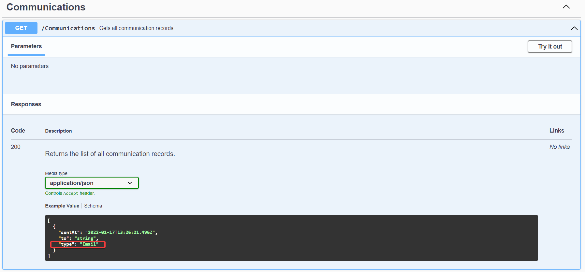
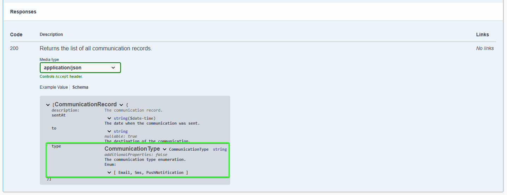

# PMart.Enumeration.SwaggerGen

This is the package to add Swagger support for the __Enumeration classes__ (more information in the [introduction page](../../README.md)).

You need it to document an __Enumeration__ property on __Swagger__ as an `enum`.

# Installation

Add the package to your project:
```bash
dotnet add package PMart.Enumeration.SwaggerGen
```

# Usage

To document on __Swagger__ an enumeration property like an `enum`, add the schema filter `EnumerationSchemaFilter` to the __Swagger__ options on your `Program.cs` (or `Startup.cs`), like in this [example](../../samples/Enumeration.SwaggerGen.Sample/Program.cs):

```c#
builder.Services.AddSwaggerGen(options =>
{
    options.SwaggerDoc("v1", new OpenApiInfo {Version = "v1", Title = "Sample API"});
    
    options.SchemaFilter<EnumerationSchemaFilter>();
});
```

Here's an example of the result:



